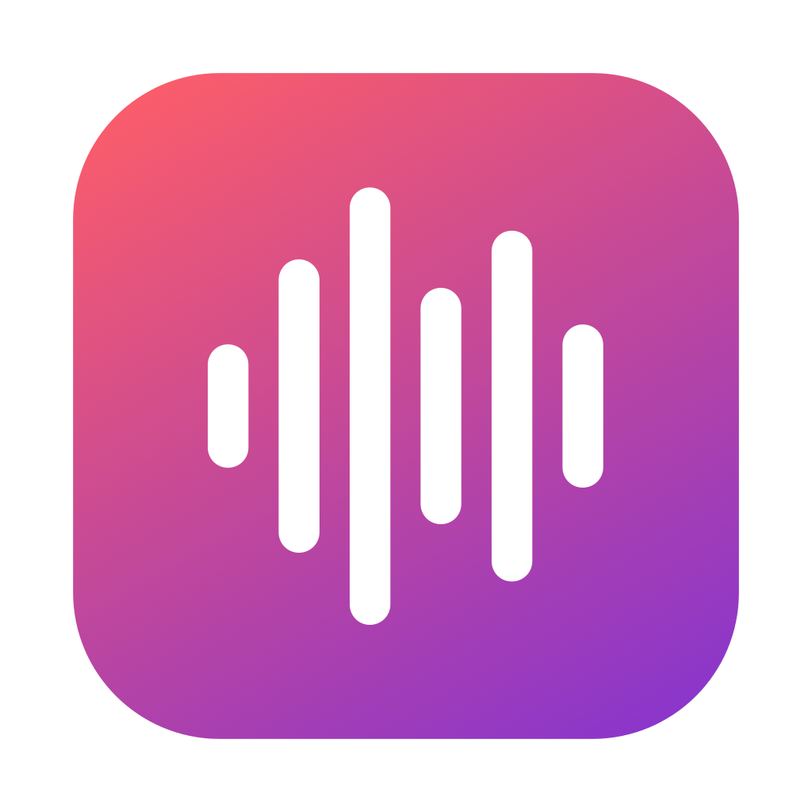
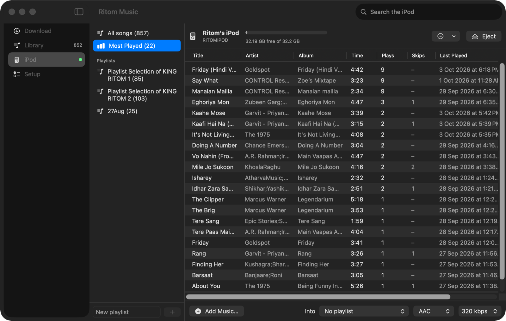
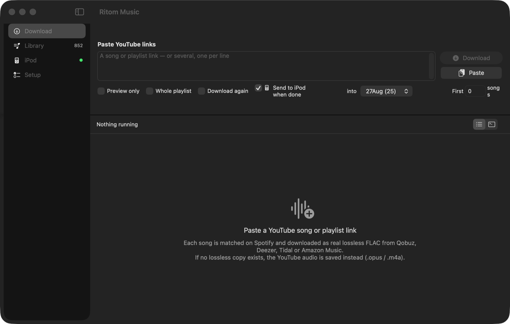
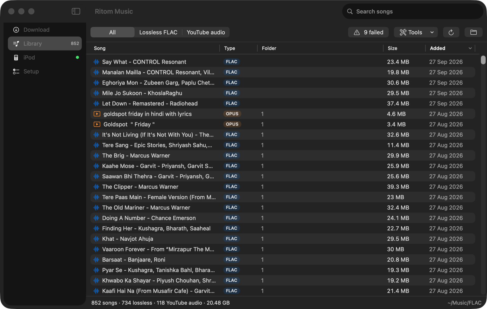
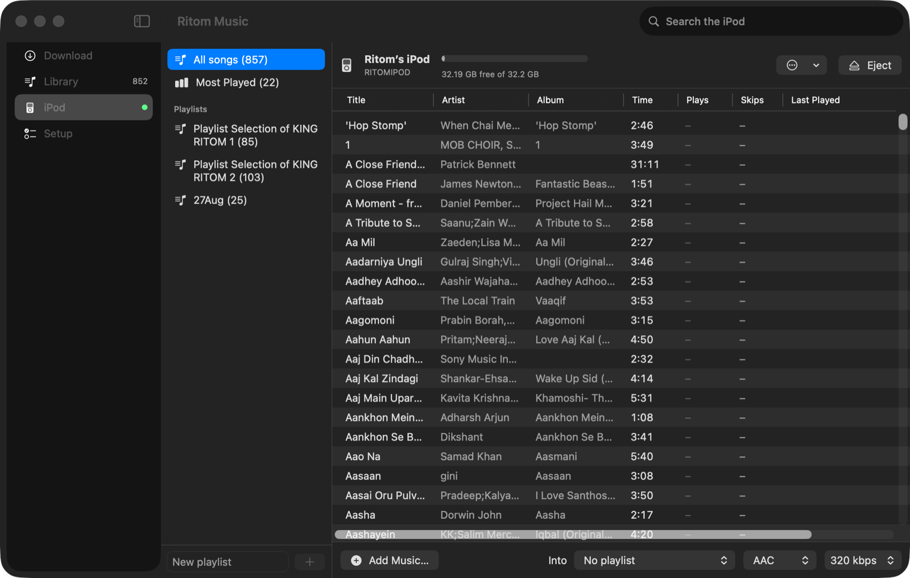
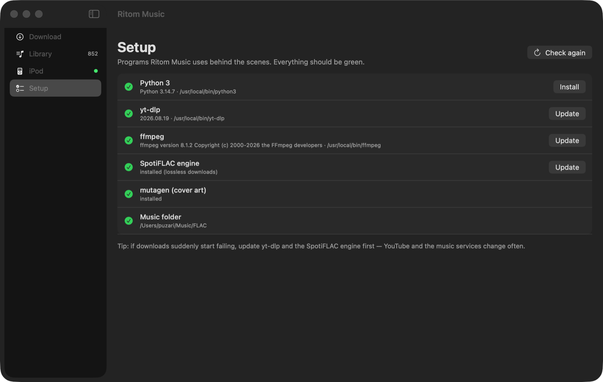

<p align="center">
  
</p>

<h1 align="center">Ritom Music</h1>

<p align="center">
  A native macOS app that turns YouTube links into a <b>lossless FLAC library</b> and puts that library on a
  <b>click-wheel iPod</b> — without iTunes or the Music app.
</p>

<p align="center">
  <a href="../../releases/latest"></a>
  
  
  <a href="LICENSE"></a>
</p>

<p align="center">
  
</p>

- **Download** — paste YouTube song or playlist links. Each track is matched to Spotify and downloaded as real
  lossless FLAC (Tidal / Qobuz / Deezer / Amazon via SpotiFLAC). If no lossless copy exists it falls back to the
  YouTube audio. Live per-track status, stop, retry, dry-run preview.
- **Library** — every song in your music folder: play, reveal, delete, check/fix cover art, verify downloads,
  retry failed tracks, send songs to the iPod.
- **iPod** — tracks and playlists on the iPod, with **play counts, skips and last played** (sortable), a
  **Most Played** view, add (drag & drop or picker) as AAC 192/256/320 kbps, ALAC or AIFF, remove, create /
  rename / delete playlists, rebuild the database, and **safe eject**.
- **Setup** — checks and installs everything the app needs with one click.
- Menu bar icon with progress, "download link from clipboard" and eject.

Built for the 5th-generation iPod (iPod Video); it writes the iPod's own `iTunesDB`, so songs and playlists show
up on the device like they were synced by iTunes.

## Screenshots

| Download | Library |
|---|---|
|  |  |
| **iPod** | **Setup** |
|  |  |

---

## Install

### Requirements

- macOS 14 Sonoma or newer, Intel or Apple Silicon
- [Homebrew](https://brew.sh) (the app uses it to install Python, ffmpeg and yt-dlp)

### 1. Download the app

1. Open the [Releases](../../releases) page and download `RitomMusic-<version>-macOS.zip` from the latest release.
2. Double-click the zip and drag **Ritom Music.app** into **Applications**.

### 2. Allow it to open

The app is not notarized by Apple, so macOS blocks it the first time. Either:

- **Terminal (quickest):**
  ```bash
  xattr -dr com.apple.quarantine "/Applications/Ritom Music.app"
  ```
- **or** open it once, then go to **System Settings → Privacy & Security**, scroll down and click
  **Open Anyway** next to "Ritom Music".

### 3. Install the dependencies

Open Ritom Music and go to **Setup**. Click **Install** next to anything marked missing:

| Component | What it's for | Installed with |
|---|---|---|
| Python 3 | runs the download and iPod engine | `brew install python` |
| ffmpeg | audio conversion, iPod encoding | `brew install ffmpeg` |
| yt-dlp | reads YouTube links | `brew install yt-dlp` |
| SpotiFLAC | lossless downloads | `pip install git+https://github.com/ShuShuzinhuu/SpotiFLAC-Module-Version nodriver` |
| mutagen | cover art | `pip install mutagen` |

Or do it all from Terminal:

```bash
brew install python ffmpeg yt-dlp
python3 -m pip install --break-system-packages --upgrade \
  "git+https://github.com/ShuShuzinhuu/SpotiFLAC-Module-Version" nodriver mutagen
```

If downloads suddenly start failing, update yt-dlp and SpotiFLAC first (Setup → **Update**) — YouTube and the
music services change often.

### 4. (Optional) Settings

**Ritom Music → Settings… (⌘,)** — music folder (default `~/Music/FLAC`), order of lossless services,
Spotify resolver, fallbacks.

---

## Using it with an iPod

1. Plug the iPod in and wait until it shows up in Finder (it must be in disk mode — FAT32 / "Windows-formatted"
   iPods work).
2. Open the **iPod** screen. The first time, click **Read iPod library** so the songs and playlists already on it
   are imported (nothing is deleted).
3. Add songs with **Add Music…**, by dropping files/folders on the screen, or from **Library → Send to iPod ▸**.
   Pick the format and bitrate in the bottom bar (AAC 256 or 320 kbps recommended; ALAC is known to skip on the
   5th gen).
4. Click **Eject** (⌘E). Wait for **"Safe to unplug"**, then unplug. If the iPod doesn't show the new songs, hold
   **Menu + centre button** for ~8 seconds to restart it.

Everything the app knows about the iPod is stored on the iPod itself (`.ipod_sync/catalog.json`, with automatic
backups of the database in `.ipod_sync/backups`), so it works from any Mac.

### Play counts

The iPod records plays in `iPod_Control/iTunes/Play Counts`. Ritom Music reads that file every time the iPod is
connected and keeps a running history on the Mac
(`~/Library/Application Support/Ritom Music/playcounts.json`), so the totals survive the iPod resetting its own
counter after a database rewrite. Click a column header to sort by **Plays**, **Skips** or **Last Played**, or
open **Most Played** in the sidebar.

---

## Build from source

No Xcode needed — just the Command Line Tools (`xcode-select --install`).

```bash
git clone https://github.com/R1tom/RitomMusic-macOS.git
cd RitomMusic-macOS/app
./build.sh            # build for this Mac   → app/build/Ritom Music.app
./build.sh install    # build and copy to /Applications
./build.sh release    # universal Intel + Apple Silicon build and zip → app/build/RitomMusic-<version>-macOS.zip
```

The Python engine is bundled into the app from `engine/`. (On the author's Mac `build.sh` takes it from
`~/Music/FLAC` instead and refreshes `engine/`; set `RM_TOOLS_SRC=<dir>` to use another copy.)

### Repository layout

```
app/                SwiftUI app (Sources/, Info.plist, build.sh, make-icon.swift)
engine/
  ytflac.py           YouTube → lossless FLAC downloader (also usable from the command line: --help)
  verify_downloads.py checks a folder against its playlist
  ipod-tool/          ipod_sync.py + ipod_db.py: iPod database writer, also a CLI (see its README)
tools/
  ipod_reencode_320.py  one-off: re-encode every song already on the iPod to 320 kbps AAC in place
                        (keeps playlists, play counts and track order; see the docstring)
```

### Testing without an iPod

```bash
mkdir -p /tmp/fakepod/iPod_Control/Music
IPOD_VOL=/tmp/fakepod "/Applications/Ritom Music.app/Contents/MacOS/RitomMusic" -lastPane iPod
```

---

## Troubleshooting

- **"Ritom Music is damaged / can't be opened"** — run the `xattr` command from step 2.
- **Downloads fail** — Setup → update yt-dlp and SpotiFLAC. Check the log under the queue.
- **Eject says the iPod is busy** — it names the app holding files; close it, or eject from Finder.
- **iPod shows no songs after unplugging** — restart it (Menu + centre button for ~8 s).
- **Undo an iPod change** — the previous databases are in `<iPod>/.ipod_sync/backups/`.

---

## License

[MIT](LICENSE) © 2026 Ritom Puzari.

The dependencies installed from Setup (ffmpeg, yt-dlp, SpotiFLAC, mutagen) are separate projects under their
own licenses and are not bundled with this app. Download only music you have the right to download.
